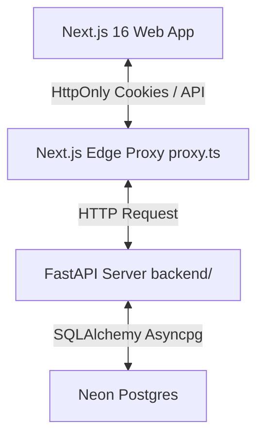

# Aura Luxury Clinic Management & POS System

This repository contains the full stack application for **Aura Luxury Clinic** management and Point-of-Sale billing.

The project features a modern **Next.js 16** frontend integrated with a secure, asynchronous **FastAPI** backend, and is backed by a **Neon Postgres** database.

---

## Architecture Overview



- **Frontend (`/DBS-System`)**: Next.js 16, React 19, Tailwind CSS, Lucide React, and Framer Motion. Uses cookies for secure sessions, and Zod for client-side form validation.
- **Backend (`/backend`)**: FastAPI (Python 3.12+), SQLAlchemy 2.0 (async), and Pydantic v2. Business logic (POS transactions, salary expense matching, inventory tracking, analytics) is executed server-side.

---

## Folder Structure

```text
DBS-System/
├── app/                  # Next.js pages & route handlers (auth login/logout/me)
├── components/           # Reusable UI elements (Buttons, Skeletons, Print Modal)
├── lib/                  # Shared utilities
│   ├── api/client.ts     # Central API client
│   ├── context/          # ClinicContext state engine
│   └── validation/       # Zod validation schemas
├── backend/              # Python FastAPI Application
│   ├── app/
│   │   ├── core/         # Security, config, and dependencies
│   │   ├── db/           # Database sessions and seed scripts
│   │   ├── models/       # SQLAlchemy models
│   │   ├── schemas/      # Pydantic validation schemas
│   │   └── routers/      # API endpoints (Auth, Clients, Staff, POS, etc.)
│   ├── tests/            # Test suite (pytest + httpx)
│   └── requirements.txt  # Python packages
├── docker-compose.yml    # Local dev orchestration
└── SETUP.md              # Database installation & run guide
```

---

## How to Run

### Docker Compose (Recommended)
You can launch both frontend and backend servers concurrently:
```bash
docker-compose up --build
```
- Frontend will be available at: `http://localhost:3000`
- Backend Swagger documentation will be available at: `http://localhost:8000/docs`

### Manual Setup
For detailed setup instructions, including database creation, running the test suites, and JWT credentials configuration, please refer to:
👉 **[SETUP.md](file:///c:/Users/amtul/Desktop/DBS-System/SETUP.md)**
👉 **[SYSTEM_GUIDE.md](file:///c:/Users/amtul/Desktop/DBS-System/SYSTEM_GUIDE.md)**
